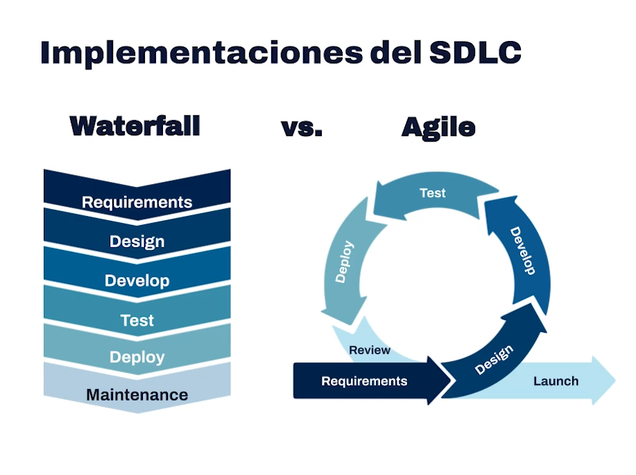
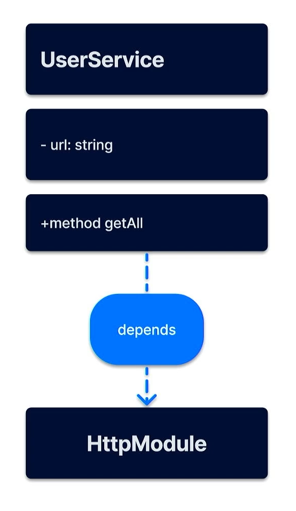
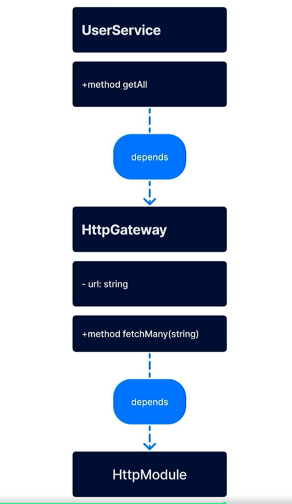
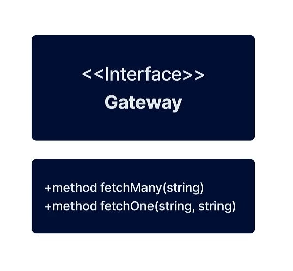
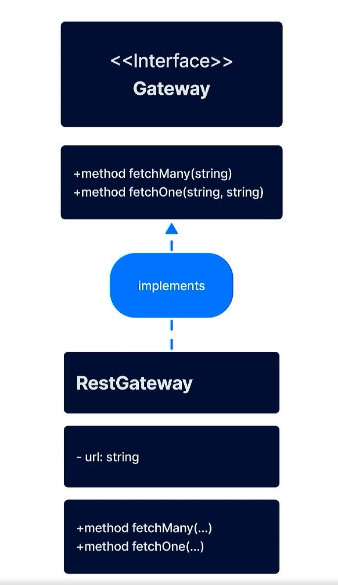
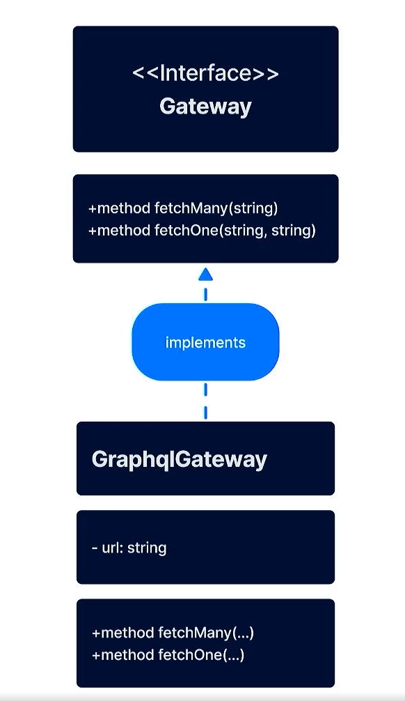
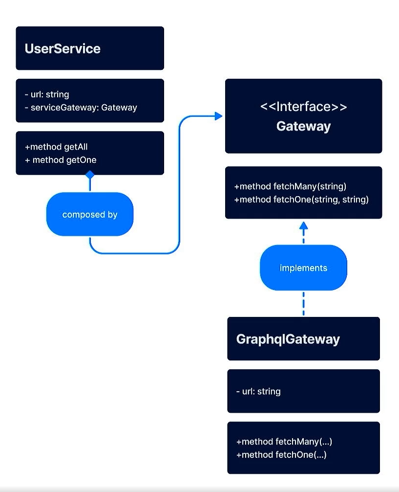

# Patrones de Diseño

## Software Development Life Cycle

### Fases

El ciclo de vida del desarrollo de software consta de varias fases:

1. 🍎 Planeación/Requerimientos.
2. ☕️ Diseño.
3. 🥩 Implementación/Ejecución/Desarrollo.
4. 🍪 Pruebas.
5. 🍷 Despliege (Deploy).
6. 💆‍♂️ Mantenimiento.

### Implementación del SDLC



## Tipos de diseño

### Caracteristicas de un buen diseño

1. Modularidad
2. Tolerancia a fallos
3. Robustez
4. Seguridad
5. Usabilidad

### Reusabilidad

- Reducción de:

  - Costos
  - Tiempo de lanzamiento

- Libera recursos para tareas más cruciales como el Marketing.

- No es necesario "reinventar la rueda"

- Eliminar la duplicación y crear una abstracción (DRY: Don´t Repeat Yourself).
  - Algunas partes no deberían ser abstraídas.
  - El código puede volverse innecesariamente complejo (acoplamineto).

#### Niveles de Reusabilidad

1. Clases/Funciones
2. Patrones de diseño
3. Frameworks

```typescript
import 'http' from 'HttpModule'
class UserService:
    private url = '/api/users'

    public method getAll() is
        return http.get(url)
```



```typescript
import 'httpGateway' from 'HttpGateway'

class UserService:
    public method getAll() is
        return httpGateway.fetchMany('users')

// HttpGateway file
import 'http' from 'HttpModule'

class HttpGateway:
    private url = '/api'

    public method fetchMany(resource) is
        // The url will be /api/users
        return http.get(url + '/' + resource)
```



### Extensibilidad

> El cambio es la única constante en el universo

- Puntos de extensión/cambio sencillos y comprensibles.
- Reglas de cambio definidas por contratos/interfaces.
- Tener una buen comprensión del problema.
- Consenso en los estándares y/o reglas que guíen el desarrollo.

```typescript
interface Gateway {
    public method fetchMany(resource)
    public method fetchOne(resource, idToFetch)
}
```



```typescript
import 'http' from 'HttpModule'
class RestGateway implements Gateway:

    private url = '/api'

    public method fetchMany(resource) is
        // The url will be /api/{resource}
        return http.get(url + '/' + resource)

    public method fetchOne(resource, idToFetch) is
        // The url will be /api/{resource}/:idToFetch
        return http.get(url + '/' + resource + '/' + idToFetch)
```



```typescript
import 'http' from 'HttpModule'

class GraphqlGateway implements Gateway:

    private url = '/api/graphql'

    public method fetchMany(resource) is
        // The url will be /api/graphql
        var body = buildBody({ resource })
        return http.post(url, body)

    public method fetchOne(resource, idToFetch) is
        // The url will be /api/graphql
        var body = buildBody({ resource, idToFetch })
        return http.post(url, body)
```



```typescript
import 'Gateway' from 'Gateway'
import 'GraphQLGateway' from 'GraphQLGateway'

class userService:

    private serviceGateway: Gateway

    public method getAll() is
        return serviceGateway.fetchMany('users')

    public method getOne(userId) is
        return serviceGateway.fetchOne('users', userId)
```



### Sencillez

#### Proceso para llegar a una solución

1. Pensamos en el problema.
2. Implementamos algo sencillo/intuitivo.
3. Nuevos Requerimientos.
4. Planear pensando en reutilizar/extender.
5. Regresar al paso 2 y repetir hasta lograr estabilidad.
